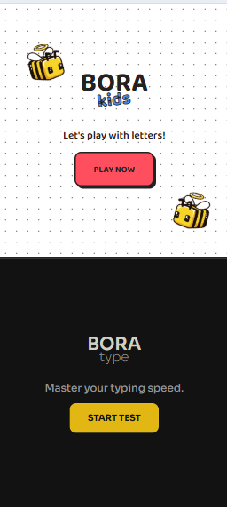
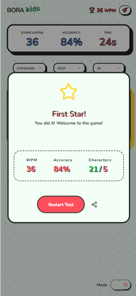
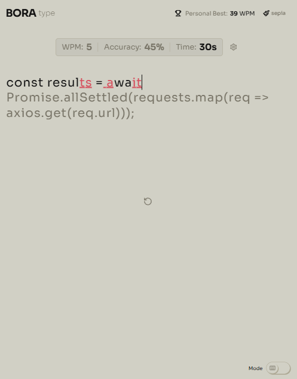
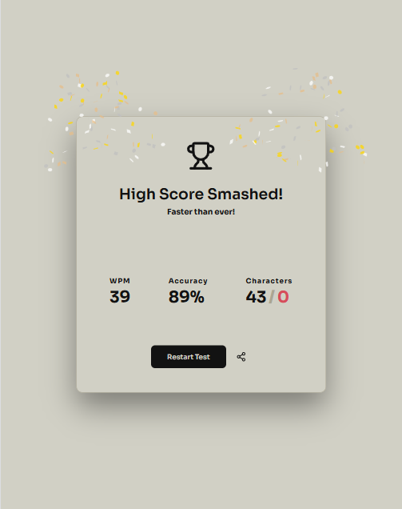
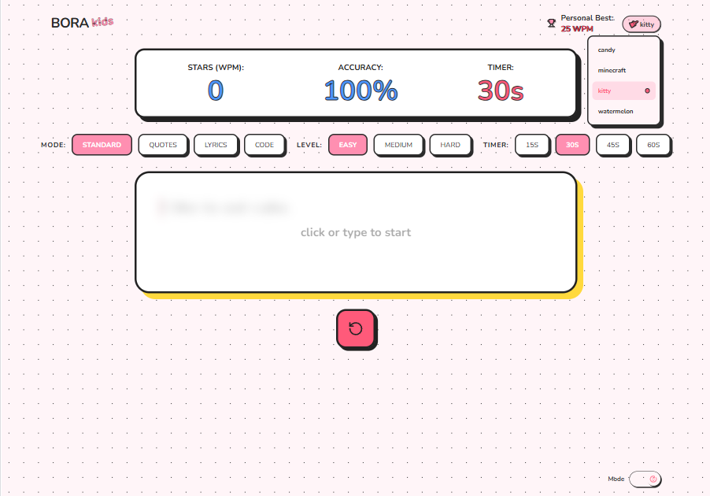
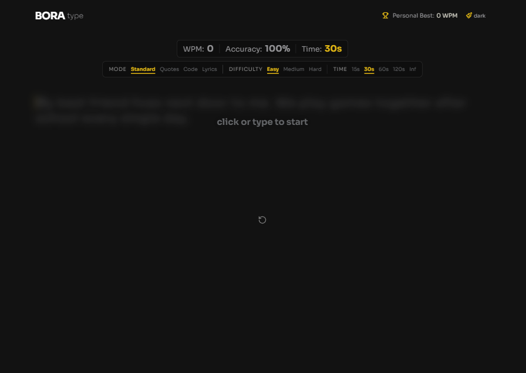

# Bora - Adaptive Typing Speed Game

## Read this in other languages

- [Português (Brasil)](./docs/README.pt-BR.md)

A comprehensive typing speed application built as a solution for a **Front End Mentor Hackathon**. This project delivers two entirely distinct user experiences: a minimalist, professional environment for adults and a vibrant, "Cartoon Pop" interface for kids.

> **Why "Bora"?**  
> "Bora" is a common Brazilian expression that roughly means "Let's go!" or "Come on!". It captures the energy and motivation behind this typing game. Encouraging users to jump in, have fun, and improve their typing speed. ;)

## The Solution

The core concept was to create a tool that adapts to the user's personality and age group. I achieved this by leveraging a robust **theme-switching architecture**, allowing the entire UI, from fonts to button physics, to transform instantly.


### Adult Mode (Minimalist & Focused)
Designed for high productivity and concentration.
- **Themes:** Light, Dark, Sepia, Sakura, and VS Code.
- **Modes:** Standard, Quotes, Code, and Lyrics.
- **Difficulty:** Easy, Medium, Hard.
- **Time Options:** 15s, 30s, 60s, 120s, and Infinite (Progressive counter).

### Kids Mode (Cartoon Pop Style)
Designed to be playful, using Neo-Brutalism.
- **Themes:** Candy, Minecraft, Kitty, and Watermelon.
- **Modes:** Standard, Quotes, Code and Lyrics.
- **Difficulty:** Easy, Medium, Hard.
- **Time Options:** 15s, 30s, 45s, 60s.

---

## Tech Stack

| Technology              | Purpose                                                |
| ----------------------- | ------------------------------------------------------ |
| **React 18 + Vite**     | App setup and UI                                       |
| **TypeScript**          | Logic and type safety                                  |
| **SASS (SCSS)**         | Mixins, loops, tokens, and modular architecture       |
| **CSS Modules**         | Scoped styling and BEM methodology                     |
| **BEM Methodology**     | Organized and maintainable CSS structure               |
| **Lucide-React**        | Icons for UI elements                                  |
| **Canvas-Confetti**     | Celebration effects when PB is broken                  |
| **CSS Keyframes**       | Animations for transitions and interactions            |
| **Prettier**            | Code formatting and consistency                        |

---

## Key Features

* **Advanced Theming & Mode Selector:** Deep use of `data-theme` attributes to swap global color palettes, border-radii, and shadows without page reloads. Includes a **Mode Selector** to switch between **Type** and **Kids** game modes.
* **Local Persistence:** Personal Best (PB) records are tracked and saved in **Local Storage**, categorized by game mode (type or kids).
* **Gamification:** A confetti celebration triggers whenever a user breaks their personal record.
* **Responsive Layout:** Fully optimized for mobile, tablet, and desktop with custom breakpoints and fluid typography.
* **Social Sharing:** Built-in **Share Button** allows users to share their scores with others.

---

## Lessons Learned

The biggest technical challenge and achievement was the **Data Theme Implementation**. 

> "I learned how powerful `data-theme` can be when combined with CSS Variables. By structuring my SASS tokens to react to data attributes on the body, I could change the entire look and feel of the app—from the minimalist VS Code vibe to a chunky Minecraft style. Using the exact same HTML logic. Managing state between two such different visual directions was a massive learning curve."

### Main Challenges
1.  **Logical Abstraction:** Keeping the typing engine identical while the UI changed drastically.
2.  **Responsive Design:** Using complex media queries to ensure the "Split Home" layout worked on small mobile screens.
3.  **WPM Accuracy:** Fine-tuning the Words Per Minute calculation and the "Personal Best" logic.

---

## Installation & Setup

1.  **Clone the repository:**
    ```bash
    git clone https://github.com/mari-codes/bora-type.git
    ```
2.  **Install dependencies:**
    ```bash
    npm install
    ```
3.  **Run the development server:**
    ```bash
    npm run dev
    ```

---

## Screenshots

### Bora Home - Mobile



### Bora Kids Modal - Mobile



### Bora type Tablet


### Bora type Tablet Modal



### Bora kids Tablet


### Bora kids Desktop



### Bora type Desktop




## Front End Mentor Hackathon
This project was developed as a custom solution for the Type Speed Game challenge, focusing on UI versatility and clean code architecture.

## Author

- Mariana Borges (Frontend Mentor Profile) - [@mari-codes](https://www.frontendmentor.io/profile/mari-codes)

